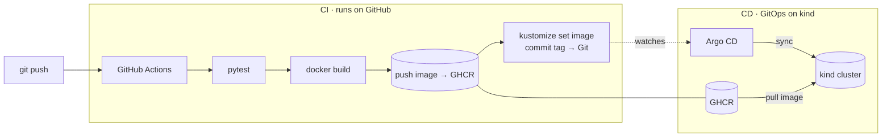

# gitops-cicd-pipeline

A complete **CI/CD + GitOps deployment pipeline**: a GitHub Actions workflow
builds, tests, and containerizes a service, publishes the image to **GHCR**, and
commits an image-tag bump back to Git. **Argo CD** then continuously reconciles a
local **Kubernetes (kind)** cluster to that Git state — giving automated rollout,
drift-correction, and rollback.



**The CI half runs genuinely end-to-end on GitHub** — every push to `main` produces
a real, pullable image at `ghcr.io/saisushaman/gitops-cicd-pipeline`. **The CD half**
(kind + Argo CD) runs locally with a single command, because a cluster needs a
container runtime that isn't available on hosted CI.

## The application

A small **FastAPI** service (`app/`) with three endpoints:

| Route        | Purpose                                             |
|--------------|-----------------------------------------------------|
| `/`          | Service metadata                                    |
| `/healthz`   | Liveness/readiness probe (`{"status":"ok"}`)        |
| `/api/info`  | Hostname + version + git SHA of the running image   |

`/api/info` reports the `APP_VERSION` and `GIT_SHA` baked into the image at build
time, so you can watch a new version roll out after a push.

## CI/CD workflow

[`.github/workflows/ci.yml`](.github/workflows/ci.yml):

1. **test** — `pytest` on Python 3.12 (runs on pushes *and* pull requests).
2. **build-and-push** (only on `main`):
   - builds the multi-stage [Dockerfile](app/Dockerfile) (non-root, healthcheck),
   - pushes `:latest` and `:<short-sha>` to **GHCR** using the built-in
     `GITHUB_TOKEN` (no external secrets),
   - runs `kustomize edit set image` to pin the deployment to the new SHA and
     **commits that bump back to `main`** — the GitOps trigger.

The bump commit only touches `deploy/**`, which the workflow's `paths-ignore`
excludes, so it never triggers an infinite build loop.

## GitOps / CD

- [`deploy/base/`](deploy/base) — Kustomize base (Deployment + Service). The image
  tag is machine-managed by CI.
- [`deploy/argocd/application.yaml`](deploy/argocd/application.yaml) — an Argo CD
  `Application` with **automated sync, prune, and self-heal**, pointed at
  `deploy/base` on `main`. Argo CD reconciles the cluster to Git continuously:
  push a change and it rolls out; delete a resource by hand and it heals.

## Run it

### 1. CI (automatic)

Push to `main` (or open a PR). Watch the run:

```bash
gh run watch
```

After it succeeds, the image is at `ghcr.io/saisushaman/gitops-cicd-pipeline`
and `deploy/base/kustomization.yaml` has been bumped to the new SHA.

### 2. CD — local cluster (one command)

Requires a Linux host or **WSL2** with `sudo`, plus `gh` logged in (so the cluster
can pull the private GHCR image). Installs Docker/kind/kubectl if missing.

```bash
make cluster-up      # kind + Argo CD + the Argo Application
make status          # Argo CD Application + app pods
make app-url         # port-forward to localhost:8080
# in another shell:
curl localhost:8080/healthz     # {"status":"ok"}
curl localhost:8080/api/info    # {"version":"1.0.N","git_sha":"...", ...}
```

Open the Argo CD UI with `make argo-ui` (it prints the admin password).

> If the GHCR package is private and you'd rather not use a pull secret, make it
> public once at `github.com/users/saisushaman/packages` and pods will pull
> anonymously.

### Local dev without a cluster

```bash
make install         # pip install app + dev deps
make test            # pytest  -> 4 passed
make run             # uvicorn on http://localhost:8000
```

## Watch a rollout (the whole loop)

1. Edit `app/main.py` (e.g. change the `/` message) and push to `main`.
2. CI tests, builds, pushes a new image, and bumps the manifest SHA.
3. Argo CD notices the Git change and syncs the new image into the cluster.
4. `curl localhost:8080/api/info` shows the new `git_sha` — zero manual `kubectl`.

To **roll back**, `git revert` the bump commit (or any change): Argo CD reconciles
the cluster back to the previous image. Git is the single source of truth.

## Layout

```
app/
  main.py                    FastAPI service
  tests/test_app.py          pytest suite
  Dockerfile                 multi-stage, non-root, healthcheck
  requirements*.txt
deploy/
  base/                      Kustomize Deployment + Service (CI-managed image tag)
  argocd/application.yaml    Argo CD Application (auto-sync, self-heal)
cluster/
  kind-config.yaml           single-node kind cluster
  setup.sh / teardown.sh     idempotent local bring-up / teardown
.github/workflows/ci.yml     test -> build -> push GHCR -> bump manifest
Makefile                     install · test · run · cluster-up · status · app-url
```

## License

MIT — see [LICENSE](LICENSE).
